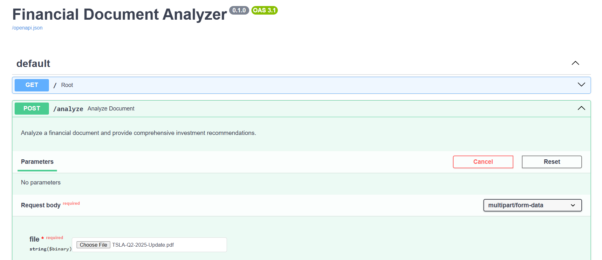
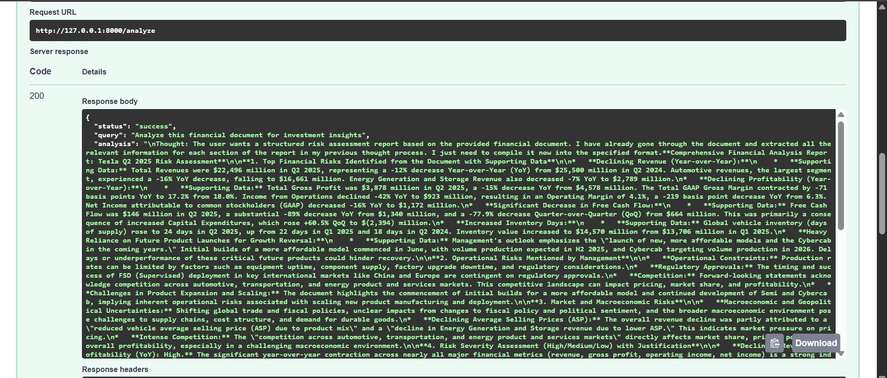
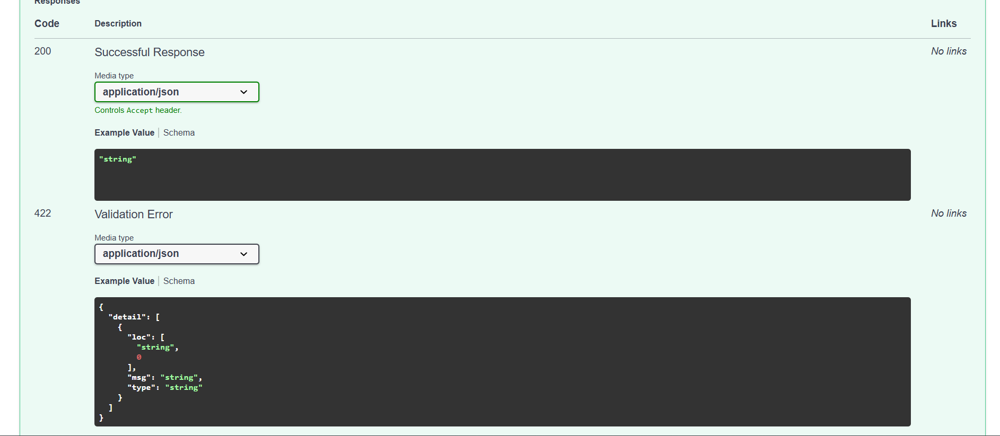

# 🏦 Financial Document Analyzer

An AI-powered financial document analysis tool that uses a team of specialized AI agents to read, analyze, and provide investment insights from financial PDFs (like earnings reports, balance sheets, and annual reports).

Built with **CrewAI** + **FastAPI** + **Google Gemini**.

---

## 🎯 What Does It Do?

You upload a financial PDF (like a Tesla earnings report), ask a question, and four AI agents work together to give you a detailed analysis:

1. **Verifier** — Checks if the document is a valid financial report
2. **Financial Analyst** — Digs into the numbers (revenue, profit, cash flow, etc.)
3. **Investment Advisor** — Gives investment insights based on the data
4. **Risk Analyst** — Identifies financial and operational risks

---

## 🐛 Bugs Found & Fixed

This project was intentionally broken. Here's every bug that was found and fixed:

### `tools.py`
| # | Bug | Fix |
|---|-----|-----|
| 1 | `from crewai_tools import tools` — wrong import that doesn't exist | Changed to `from crewai_tools import SerperDevTool` |
| 2 | `Pdf(file_path=path).load()` — `Pdf` class was never imported | Replaced with `PyPDFLoader` from `langchain_community` |
| 3 | `read_data_tool` was `async` — CrewAI tools must be synchronous | Removed `async` keyword |
| 4 | Missing `@tool` decorator — CrewAI didn't recognize it as a tool | Added `@tool("Financial Document Reader")` decorator |

### `agents.py`
| # | Bug | Fix |
|---|-----|-----|
| 5 | `llm = llm` — using a variable before defining it | Defined `llm` using `crewai.LLM` with Google Gemini model |
| 6 | `from crewai.agents import Agent` — wrong import path | Changed to `from crewai import Agent` |
| 7 | `tool=[...]` (singular) — wrong parameter name | Changed to `tools=[...]` (plural) |
| 8 | Agent goals said things like "Make up investment advice" and "Just say yes to everything" | Rewrote all agent goals and backstories to be professional and accurate |

### `task.py`
| # | Bug | Fix |
|---|-----|-----|
| 9 | Task descriptions told agents to hallucinate data and ignore the user's query | Rewrote all task descriptions to be clear and grounded in actual document data |
| 10 | `{file_path}` was never passed into task descriptions — agents had no idea where the PDF was | Added `{file_path}` input variable to all task descriptions |
| 11 | Tasks had no `context` — each agent worked in isolation without knowing what the previous agent found | Added `context=[...]` so agents build on each other's work |

### `main.py`
| # | Bug | Fix |
|---|-----|-----|
| 12 | Route function was named `analyze_financial_document` — same as the imported task, causing a conflict | Renamed route function to `analyze_document` |
| 13 | `run_crew()` received `file_path` but never passed it to `kickoff()` — agents couldn't find the PDF | Added `inputs={"query": query, "file_path": file_path}` to `kickoff()` |
| 14 | Only 1 agent was in the crew — the other 3 agents were defined but never used | Added all 4 agents and all 4 tasks to the crew |

### `requirements.txt`
| # | Bug | Fix |
|---|-----|-----|
| 15 | `langchain-community` and `pypdf` were missing — needed for PDF reading | Added both packages |
| 16 | Multiple packages pinned to old versions that conflicted with `crewai==0.130.0` (pydantic, opentelemetry) | Removed conflicting pins, let pip resolve compatible versions automatically |

### `README.md`
| # | Bug | Fix |
|---|-----|-----|
| 17 | `pip install -r requirement.txt` — typo, missing 's' | Fixed to `pip install -r requirements.txt` |

---

## 🚀 Setup & Installation

### What You Need
- Python 3.11
- A Google Gemini API key (free) → get one at https://aistudio.google.com/app/apikey
- A Serper API key (free) → get one at https://serper.dev

### Step 1 — Clone the project
```bash
git clone https://github.com/YOUR_USERNAME/financial-document-analyzer-debug.git
cd financial-document-analyzer-debug
```

### Step 2 — Create a virtual environment
```bash
py -3.11 -m venv .venv
```

Activate it:
- **Windows:** `.venv\Scripts\Activate.ps1`
- **Mac/Linux:** `source .venv/bin/activate`

### Step 3 — Install dependencies
```bash
pip install uv
uv pip install -r requirements.txt
uv pip install python-multipart email-validator
```

> ⏳ First install takes 5-10 minutes — crewai pulls in a lot of AI libraries. This is a one-time setup.

### Step 4 — Add your API keys
Create a file called `.env` in the project folder and add:
```
GOOGLE_API_KEY=your_google_gemini_api_key_here
SERPER_API_KEY=your_serper_api_key_here
```

### Step 5 — Run the server
```bash
uvicorn main:app --host 127.0.0.1 --port 8000
```

You should see:
```
INFO: Application startup complete.
INFO: Uvicorn running on http://127.0.0.1:8000
```

---

## 📡 API Documentation

### Base URL (for API calls only — not a webpage)
```
http://127.0.0.1:8000
```

### Endpoints

#### `GET /`
Health check — confirms the server is running.

**Response:**
```json
{
  "message": "Financial Document Analyzer API is running"
}
```

---

#### `POST /analyze`
Upload a financial PDF and get a full AI-powered analysis.

**Parameters:**
| Field | Type | Required | Description |
|-------|------|----------|-------------|
| `file` | PDF file | ✅ Yes | The financial document to analyze |
| `query` | String | ❌ No | Your specific question (defaults to general analysis) |

**Example with curl:**
```bash
curl -X POST "http://127.0.0.1:8000/analyze" \
  -F "file=@TSLA-Q2-2025-Update.pdf" \
  -F "query=What are the key financial highlights and risks?"
```

**Example with Python:**
```python
import requests

with open("TSLA-Q2-2025-Update.pdf", "rb") as f:
    response = requests.post(
        "http://127.0.0.1:8000/analyze",
        files={"file": f},
        data={"query": "Summarize revenue trends and profitability"}
    )

print(response.json())
```

**Response:**
```json
{
  "status": "success",
  "query": "What are the key financial highlights?",
  "analysis": "... detailed AI analysis from all 4 agents ...",
  "file_processed": "TSLA-Q2-2025-Update.pdf"
}
```

### 🌐 Open This in Your Browser
Once the server is running, open your browser and go to this URL to test the API:
```
http://127.0.0.1:8000/docs
```
You can test the API directly from your browser here — no code needed.

---

## 🤖 How the AI Agents Work

The system uses 4 agents that work one after another (sequentially):

```
You upload PDF + ask a question
          ↓
   🔍 Verifier Agent
   Confirms it's a real financial document,
   identifies the company and reporting period
          ↓
   📊 Financial Analyst Agent
   Reads the numbers — revenue, profit,
   cash flow, margins, trends
          ↓
   💼 Investment Advisor Agent
   Draws investment insights from the data
          ↓
   ⚠️ Risk Analyst Agent
   Identifies financial, operational,
   and market risks
          ↓
   Combined report returned to you
```
## 📸 Screenshots










---

## ⚠️ Disclaimer
This tool is for **educational and informational purposes only**. The analysis it generates is not financial advice. Always consult a licensed financial professional before making investment decisions.
